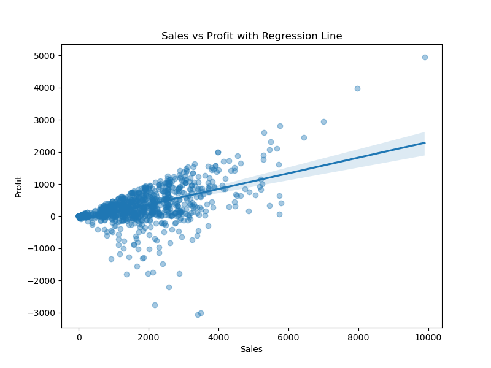
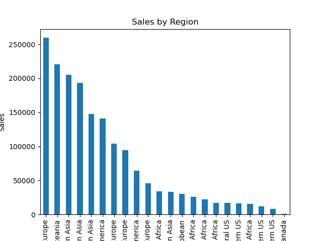
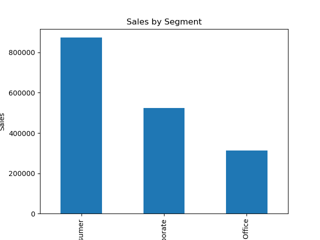
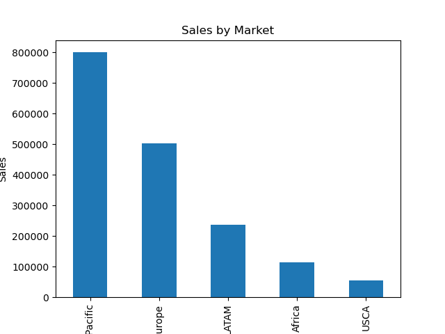
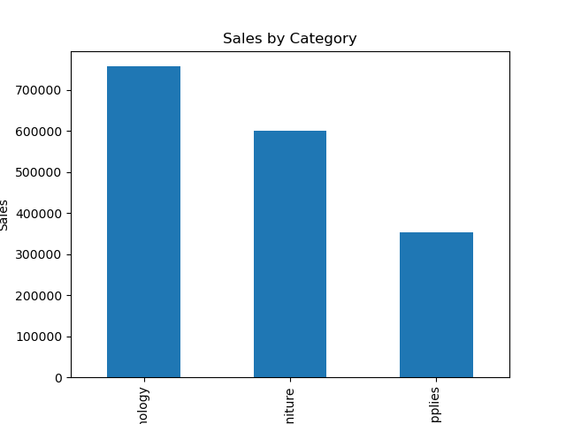
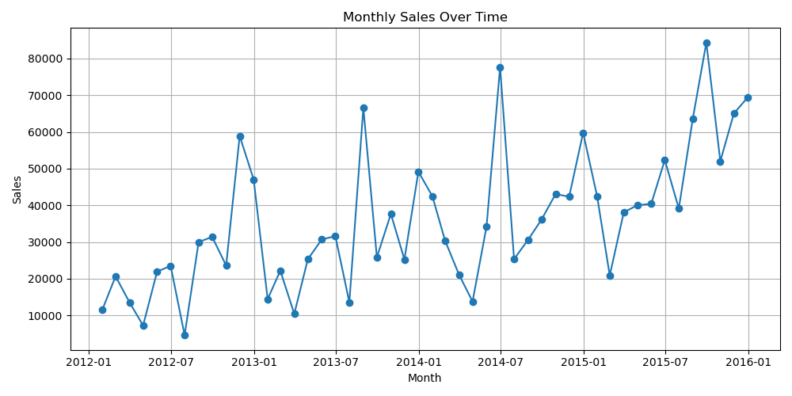

# EDA-on-Sales-Data Project

 The project is to conduct an  Exploratory Data Analysis (EDA) of GlobalMart's Retail Chain Sales Data 

 GlobalMart is a large international retail chain. The company wants to understand its sales performance across different regions, product categories, and time periods.

[Notebook Link](https://github.com/Kurodataio/EDA-on-Sales-Data/blob/main/EDA-on-Sales-Data.ipynb)  

---

## Table of Contents

- [Overview](#overview)  
- [Dataset](#dataset)  
- [Technologies Used](#technologies-used)  
- [Installation](#installation)  
- [Usage](#usage)  
- [Analysis & Visualizations](#analysis--visualizations)  
- [Conclusion](#conclusion)  
- [Credits](#credits)  
- [License](#license)  

---

## Overview

 The task is to perform an exploratory data analysis on the company's sales data to uncover insights that can drive business decisions.

---

## Dataset

- Source of the dataset is **'Global_Superstore.csv'** and sourced from ITOnlinelearning/Kaggle 
- The dataset has **1000 rows and 24 columns/features**
- Key features/columns are Product name,, Sale , Quantity, Category, Region, Segment
- The Postal code feature was dropped due to missing values of 80% of the dataset
- Duplicated rows, valid feature types such as dates where checked

---

<h2>Technologies Used</h2>

<ul>
  <li><strong>Languages & Libraries:</strong> Python, Pandas, NumPy, Matplotlib, Seaborn, Statsmodel</li>
  <li><strong>Tools:</strong> Jupyter Notebook, VS Code, Git, GitHub</li>
</ul>

<p>
  
  
  
  
  
  

</p>

<P>
  
    
  
  
</p>
<p>
  

</p>

---

## Installation

Step-by-step instructions to set up the project locally:

```bash

# Clone the repository
git clone https://github.com/Kurodataio/EDA-on-Sales-Data.git

# Navigate to the project folder
cd EDA-on-Sales-Data

# Launch Jupyter Notebook
jupyter notebook


```

## Usage

Instructions for using the project:

1. Open the main notebook (`EDA-on-Sales-Data.ipynb`)  
2. Run each cell sequentially to reproduce the analysis  
3. Visualizations and results will be generated automatically  

A sample image generated in the Jupyter note is shown below:  

 

---

## Analysis & Visualizations 

The total Sales was $1710971.47
The Total Profit was $288920.44

The Top 5 global sales Category were Office Supplies and Technology.
The GBC Ibimaster 500 Manual ProClick Binding System had the highest sales at $9892.74
Western Europe had the highest sales of $25,9576.28

 
 
The following top 4 areas wre Oceania, Southern Asia, Eastern and Southeastern Asia
The consumer segment was the selling segment with $873512.42

 

The data surprisingy shows that the Asia Market had the highest sales, whilst the lowerst was the US/Canada market.

 


 

Relationship between Sales and Profit
There is a positive but moderate relationship between Sales and Profit.
The correlation value 0.533676, indicative of this.

 

Unsurprisingly, it confirms that as sales increase, profit tends to increase. However we can also see that there are sales which are not profitable as the sales volume increases.

The plot of monthly sales over time show increased sales around the months of January, July, August and  October during the period 2012 to 2016.

 

---

## Conclusion 

- The data shows an long term upward trend, growth
- There are seasonaly aspects to the Sales data
  - **Holiday spikes** (Nov–Dec)  
  - **Back‑to‑school bumps** (Aug–Sep)  
  - **Slow periods** in Jan - March (Q1) 

---

## Credits

- **Tutorials / References:** ITOnlinelearning.com 
- **Dataset Source:** ITOnlinelearning.com 

---

## License

This project is licensed under the [MIT License](https://choosealicense.com/licenses/mit/). GlobalMart is a fictional company.

---

<p align="center"><strong>Thanks for visiting! 🚀</strong></p>
